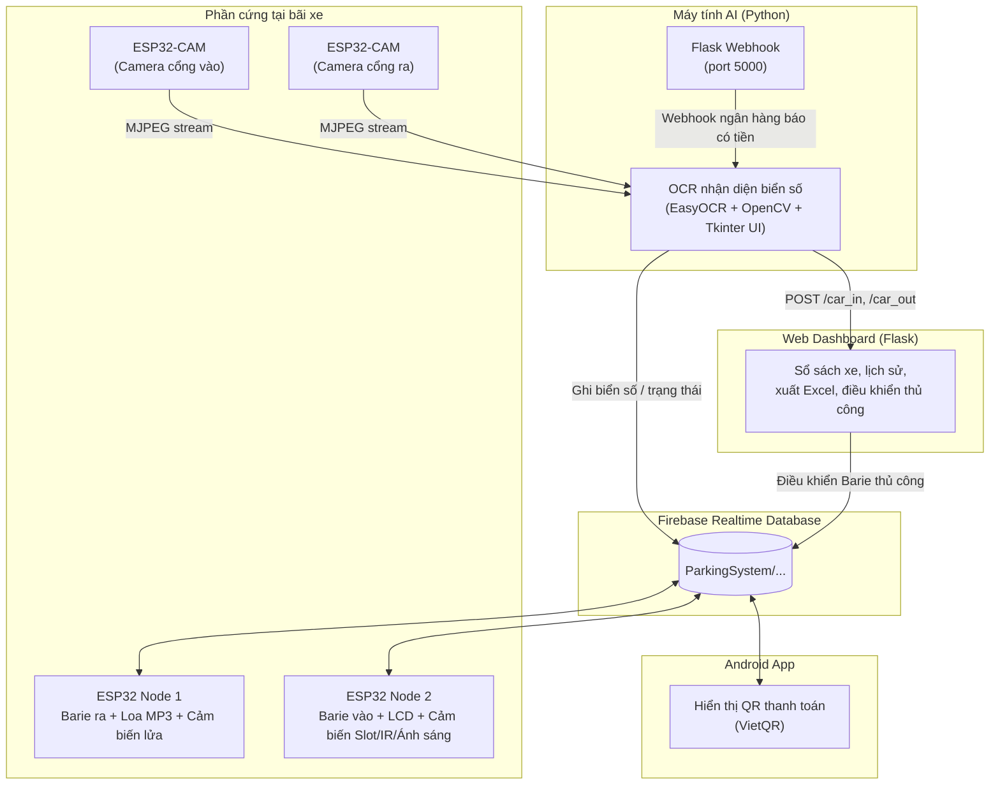

# Smart Parking System — Hệ thống bãi đỗ xe thông minh

Hệ thống bãi đỗ xe thông minh tự động hoá toàn bộ quy trình **vào – gửi xe – thanh toán – ra bãi**, kết hợp giữa phần cứng IoT (ESP32), nhận diện biển số bằng AI (OCR), thanh toán chuyển khoản QR tự động, và giám sát/điều khiển qua Firebase Realtime Database.

Video demo hoạt động thực tế: [`smart-parking-system.mp4`](https://youtu.be/SgE9geUWcJk)

---

## Mục lục

- [Tổng quan](#-tổng-quan)
- [Kiến trúc hệ thống](#-kiến-trúc-hệ-thống)
- [Tính năng chính](#-tính-năng-chính)
- [Cấu trúc thư mục](#-cấu-trúc-thư-mục)
- [Công nghệ sử dụng](#-công-nghệ-sử-dụng)
- [Sơ đồ dữ liệu Firebase](#-sơ-đồ-dữ-liệu-firebase-realtime-database)
- [Luồng hoạt động](#-luồng-hoạt-động)
- [Phần cứng & Sơ đồ chân](#-phần-cứng--sơ-đồ-chân)
- [Hướng dẫn cài đặt](#-hướng-dẫn-cài-đặt)
- [Lưu ý bảo mật](#-lưu-ý-bảo-mật)
- [Tác giả](#-tác-giả)

---

## Tổng quan

Dự án mô phỏng một bãi đỗ xe thông minh quy mô nhỏ (4 chỗ đỗ), gồm 5 thành phần phối hợp với nhau qua **Firebase Realtime Database** làm trung tâm dữ liệu:

| Thành phần | Vai trò |
|---|---|
| **AI Camera Server** (Python) | Nhận diện biển số xe (OCR) từ 2 camera ESP32-CAM (cổng vào/ra), tính tiền, đẩy dữ liệu lên Firebase |
| **ESP32 Node 1** | Điều khiển Barie cổng ra, loa thông báo MP3 (biển số, chỗ trống, chào tạm biệt), cảm biến lửa |
| **ESP32 Node 2** | Điều khiển Barie cổng vào, màn hình LCD hiển thị trạng thái, cảm biến hồng ngoại (IR) 4 vị trí đỗ, cảm biến ánh sáng (bật đèn tự động), còi báo động |
| **ESP32-CAM** (x2) | Camera streaming hình ảnh xe ra/vào cho AI xử lý |
| **Web Dashboard** (Flask) | Ghi sổ sách xe vào/ra, xuất báo cáo Excel, điều khiển Barie thủ công |
| **Android App** (Java) | Hiển thị mã QR VietQR để khách thanh toán, tự động chuyển màn hình khi nhận được tiền |

---

## Kiến trúc hệ thống



**Vòng đời một lượt gửi xe:**

1. Xe vào → camera ESP32-CAM chụp → AI Python OCR đọc biển số → ghi lên Firebase → **ESP32 Node 2** mở Barie vào, hiển thị LCD, **ESP32 Node 1** phát loa chào mừng + đọc biển số + thông báo ô trống.
2. Xe muốn ra → camera cổng ra đọc biển số → AI tính tiền theo thời gian gửi → cập nhật Firebase `status = 2` → **Android App** hiển thị mã QR VietQR để thanh toán.
3. Ngân hàng gửi webhook báo có tiền về → Flask server đối chiếu biển số trong nội dung chuyển khoản → cập nhật `status = 3` → App báo "Thanh toán thành công" → **ESP32 Node 1** mở Barie ra, phát loa tạm biệt.
4. Nếu phát hiện lửa/khói ở bất kỳ đâu → cả hai ESP32 tự động mở Barie khẩn cấp + còi hú tại chỗ.

---

## Tính năng chính

-  **Nhận diện biển số xe tự động (ALPR)** bằng EasyOCR, có cơ chế:
  - Làm mượt hình ảnh (CLAHE, bilateral filter)
  - Ép sửa lỗi ký tự dễ nhầm (số -> chữ: `0->D`, `1->T`, `8->B`...)
  - Xác nhận biển số liên tiếp (streak ≥ 5 lần khớp) để tránh đọc sai
  - Ghi nhớ các biển số đã biết để tự sửa lỗi lệch 1 ký tự
- **Điều khiển Barie tự động** cho cả cổng vào và cổng ra qua Servo
- **Giám sát 4 vị trí đỗ xe** theo thời gian thực bằng cảm biến hồng ngoại, hiển thị trên LCD 16x2 và Firebase
- **Tính phí gửi xe tự động** theo khung giờ/ngày (bậc thang giá)
- **Thanh toán không tiền mặt** qua mã QR VietQR (chuyển khoản ngân hàng MB)
- **Webhook đối soát ngân hàng**: tự động khớp nội dung chuyển khoản với biển số xe đang chờ thanh toán, không cần thao tác thủ công
- **Loa thông báo bằng giọng nói** (module MP3): chào mừng, đọc từng ký tự biển số, thông báo số ô trống, báo cháy, tạm biệt
- **Phát hiện cháy/khói khẩn cấp**: tự động mở toàn bộ Barie + còi báo động khi có cảnh báo
- **Bật đèn tự động** theo cường độ ánh sáng môi trường (cảm biến BH1750)
- **Dashboard quản trị web**: sổ sách xe trong bãi, lịch sử ra/vào, xuất báo cáo Excel, điều khiển Barie thủ công từ xa
- **Ứng dụng Android** hiển thị QR thanh toán theo thời gian thực (Firebase listener)

---

## Cấu trúc thư mục
```text
Smart-Parking-System/
├── Smart-Parking-Systerm/
│   ├── Python/
│   │   ├── CameraWebServer1703newupdate/
│   │   │   └── CameraWebServer1703newupdate.ino # Firmware ESP32-CAM (stream video)
│   │   └── code python real 1.py # App AI: OCR biển số + tính tiền + Flask webhook
│   │
│   ├── Web_Dashboard/
│   │   ├── database.py # Flask server: sổ sách, lịch sử, điều khiển thủ công
│   │   ├── templates/
│   │   │   └── index.html # Giao diện dashboard
│   │
│   ├── app_thu_tien/ # Ứng dụng Android (Java + Gradle)
│   │   └── app/src/main/java/com/phuoc/smartparking/
│   │       └── MainActivity.java # Hiển thị QR thanh toán VietQR
│   │
│   ├── esp32_node1/
│   │   └── esp32_node1.ino # Barie ra, loa MP3, cảm biến lửa
│   │
│   └── esp32_node2/
│       └── esp32_node2.ino # Barie vào, LCD, cảm biến slot/IR/ánh sáng, còi
│
└── video_demo.mp4 # Video demo hệ thống hoạt động
```
---

## Công nghệ sử dụng

**Backend / AI:**
- Python 3, OpenCV, EasyOCR, Tkinter (giao diện AI Camera)
- Flask (webhook thanh toán + web dashboard)
- Firebase Admin SDK, openpyxl (xuất Excel)

**Firmware nhúng (ESP32, Arduino/C++):**
- `WiFi.h`, `HTTPClient.h` — giao tiếp REST với Firebase (Node 1)
- `FirebaseESP32.h` — SDK Firebase chính thức (Node 2)
- `ESP32Servo.h` — điều khiển Barie
- `LiquidCrystal_I2C.h` — màn hình LCD
- `BH1750.h` — cảm biến ánh sáng
- `DIYables_MiniMp3.h` — module phát MP3 qua UART
- `esp_camera.h` — ESP32-CAM streaming

**Cloud:**
- Firebase Realtime Database

**Mobile:**
- Android (Java), Firebase Realtime Database SDK, Glide (tải ảnh QR)
- Cổng thanh toán: VietQR API

**Frontend Dashboard:**
- HTML/Flask templates (Jinja2)

---

## Sơ đồ dữ liệu Firebase Realtime Database
```text
ParkingSystem/
├── CurrentVehicle/
│   ├── license_plate # Biển số xe đang xử lý thanh toán
│   ├── status # 0: nghỉ | 2: chờ thanh toán | 3: đã thanh toán
│   ├── amount # Số tiền cần thanh toán (VNĐ)
│   ├── date_in / date_out
│
├── GateControl/
│   ├── action # Lệnh điều khiển chung (đọc bởi AI app)
│   ├── EntryGate/
│   │   ├── plate # Biển số vừa nhận diện ở cổng vào
│   │   ├── servo # "open" | "close" (điều khiển thủ công)
│   │   └── time_in
│   └── ExitGate/
│       ├── plate
│       ├── servo
│       └── time_out
│
├── Sensors/
│   ├── Slots/
│   │   ├── slot1 … slot4 # true/false: có xe hay trống
│   └── Environment/
│       ├── fire1, fire2 # Trạng thái cảm biến lửa
│       ├── flame_alert # Cờ báo cháy toàn hệ thống
│       └── lux # Cường độ ánh sáng (lux)
│
└── History/
    └── {bienso}/
        ├── license_plate
        ├── time_in / date_in
        ├── time_out / date_out
        └── total_amount
```

## Luồng hoạt động

### 1. Xe vào bãi
1. Camera cổng vào (ESP32-CAM) stream video → AI Python quét & nhận diện biển số (5 lần liên tiếp trùng khớp mới chấp nhận).
2. AI ghi lịch sử vào `History/{biển số}` và cập nhật `GateControl/EntryGate/plate` trên Firebase, đồng thời gửi `POST /car_in` tới Web Dashboard để ghi sổ.
3. **ESP32 Node 2** phát hiện có biển số mới → mở Barie vào, hiển thị "MOI VAO" trên LCD trong 5 giây rồi tự đóng.
4. **ESP32 Node 1** phát loa chào mừng, đọc từng ký tự biển số, và thông báo các ô còn trống.

### 2. Xe ra & thanh toán
1. Camera cổng ra nhận diện biển số → AI tính tiền dựa trên thời gian gửi (`calculate_fee`) → cập nhật `CurrentVehicle` với `status = 2`.
2. **Android App** đang lắng nghe Firebase, tự động hiển thị mã QR VietQR (ngân hàng MB) với đúng số tiền và nội dung chuyển khoản chứa biển số xe.
3. Khách quét mã chuyển khoản → ngân hàng gọi **webhook** `/webhook` về AI server.
4. Webhook đối chiếu biển số trong nội dung chuyển khoản với xe đang chờ → nếu khớp: đặt `status = 3` và đẩy biển số vào `ExitGate/plate`.
5. **ESP32 Node 1** phát hiện `status = 3` → mở Barie ra, phát loa "Chào tạm biệt", tự đóng lại sau 6 giây, dọn dữ liệu về `---`.
6. **Android App** hiển thị "THANH TOÁN THÀNH CÔNG — MỜI XE RA KHỎI BÃI".

### 3. Cảnh báo cháy khẩn cấp
- Bất kỳ lúc nào cảm biến lửa ở Node 1 kích hoạt → ghi `flame_alert = true`, `fire1/fire2 = 1` lên Firebase, mở Barie ra ngay lập tức, phát loa báo cháy.
- **ESP32 Node 2** đọc thấy `fire1`/`fire2` > 0 → hú còi liên tục + hiển thị `!!! FIRE !!! EMERGENCY` trên LCD, bất kể trạng thái khác.
- Khi hết cháy, hệ thống tự reset về trạng thái an toàn.

---

## Phần cứng & Sơ đồ chân

### ESP32 Node 1 — Barie ra / Loa / Cảm biến lửa
| Chân | Chức năng |
|---|---|
| GPIO 13 | Servo Barie cổng ra |
| GPIO 34 | Cảm biến lửa 1 (Flame sensor) |
| GPIO 35 | Cảm biến lửa 2 |
| GPIO 16 / 17 | UART2 (RX/TX) — Module MP3 |

### ESP32 Node 2 — Barie vào / LCD / Cảm biến Slot
| Chân | Chức năng |
|---|---|
| GPIO 13 | Servo Barie cổng vào |
| GPIO 15 | Cảm biến IR cổng vào |
| GPIO 4  | Cảm biến IR cổng ra |
| GPIO 23 | Còi (Buzzer) |
| GPIO 14, 27, 26, 33 | Cảm biến IR — vị trí đỗ 1, 2, 3, 4 |
| GPIO 21, 22 | I2C (SDA/SCL) — LCD 16x2 + cảm biến ánh sáng BH1750 |
| GPIO 12, 18 | Điều khiển đèn chiếu sáng tự động |

### ESP32-CAM (x2)
- Chạy firmware `CameraWebServer` gốc của Espressif, cấu hình theo board (`board_config.h`), stream MJPEG tại `http://<ip>:81/stream`, dùng cho camera vào (`URL_CAM_VAO`) và camera ra (`URL_CAM_RA`).

---

## Hướng dẫn cài đặt

### 1. Nạp firmware ESP32
- Mở `esp32_node1/esp32_node1.ino` và `esp32_node2/esp32_node2.ino` bằng **Arduino IDE**.
- Cài các thư viện: `ESP32Servo`, `FirebaseESP32`, `LiquidCrystal_I2C`, `BH1750`, `DIYables_MiniMp3`.
- Cập nhật `WIFI_SSID`, `WIFI_PASSWORD`, `FIREBASE_HOST`, `FIREBASE_AUTH` theo môi trường của bạn.
- Nạp firmware `CameraWebServer1703newupdate.ino` cho 2 board ESP32-CAM (cổng vào/ra), ghi lại địa chỉ IP được cấp.

### 2. Chạy AI Camera Server (Python)
```bash
cd Smart-Parking-Systerm/Python
pip install opencv-python easyocr pillow firebase-admin flask requests numpy
```
- Tải file `serviceAccountKey.json` (Firebase service account) và đặt cùng thư mục.
- Cập nhật các biến `URL_CAM_VAO`, `URL_CAM_RA`, `WEB_SERVER_IN`, `WEB_SERVER_OUT` theo IP thực tế của ESP32-CAM và Web Dashboard.
- Chạy:
```bash
python "code python real 1.py"
```

### 3. Chạy Web Dashboard
```bash
cd Smart-Parking-Systerm/Web_Dashboard
pip install flask firebase-admin openpyxl
python database.py
```
Truy cập `http://localhost:5000` để xem sổ sách, lịch sử, xuất Excel và điều khiển Barie thủ công.

### 4. Build ứng dụng Android
- Mở thư mục `app_thu_tien/` bằng **Android Studio**.
- Đảm bảo có file `google-services.json` hợp lệ (Firebase) trong `app/`.
- Cập nhật thông tin ngân hàng nhận tiền trong `MainActivity.java` (`BANK_ID`, `ACCOUNT_NO`, `ACCOUNT_NAME`).
- Build & chạy trên thiết bị/máy ảo (minSdk 21, targetSdk 36).

---
